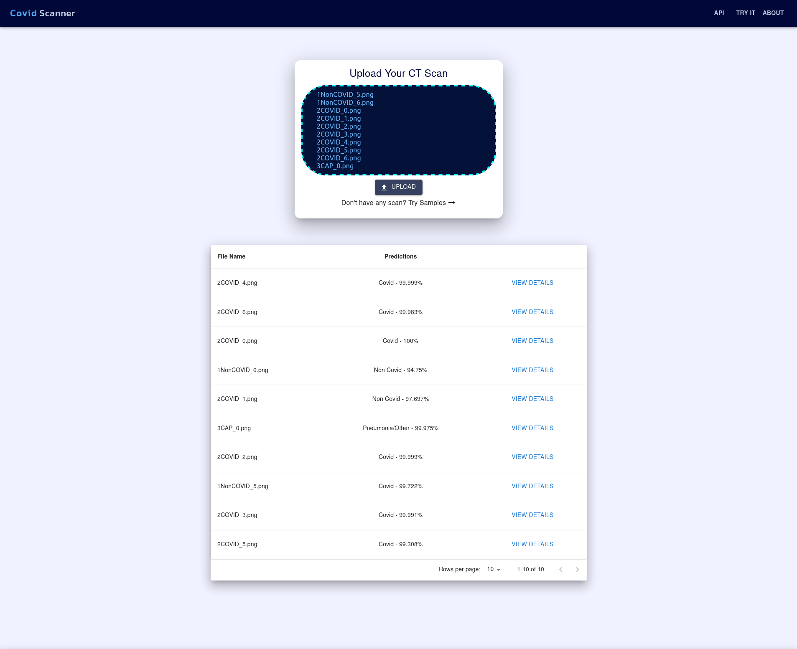

# CovidScanner 
CovidScanner is a web app that helps in detecting whether a CT scan belongs to a
covid patient or not. It uses Deep Learning models in backend to provide accurate predictions.

    

        <strong style="font-size: 20px"> Screenshots </strong>
    

    
    
    

To view the detailed ML study, [visit here](https://covidscaner.herokuapp.com/STUDY.html)